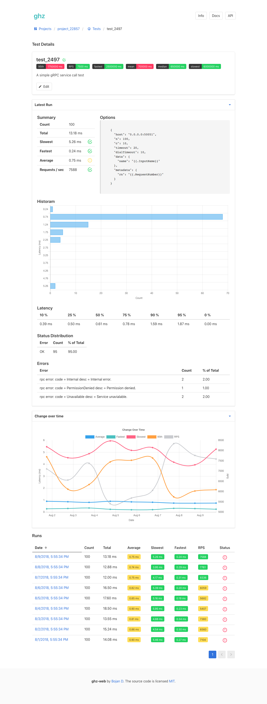

# ghz-web

Web API for tracking [ghz](https://github.com/bojand/ghz) runs.

Ingests JSON results from ghz runs and keeps them over time for view and analysis.

Threshold criteria can be set for passing / failing runs and tests.

Still work in progress.

### Screenshot

	 
	
	 

### Goals 

Planned features:

* Single executable for running the service, API and user interface.
* SQLite, MySQL, and Postgres support.
* Simple API to ingest `ghz` run JSON results.
* User interface to track and analyze results.

### Status

Alpha-ish. Compiles and executes. API and UX mostly done. Results can be ingested and data viewed. Things mostly work but lots of wrapping up to do. See `TODO.md`.
